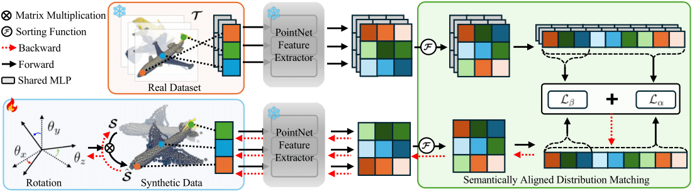
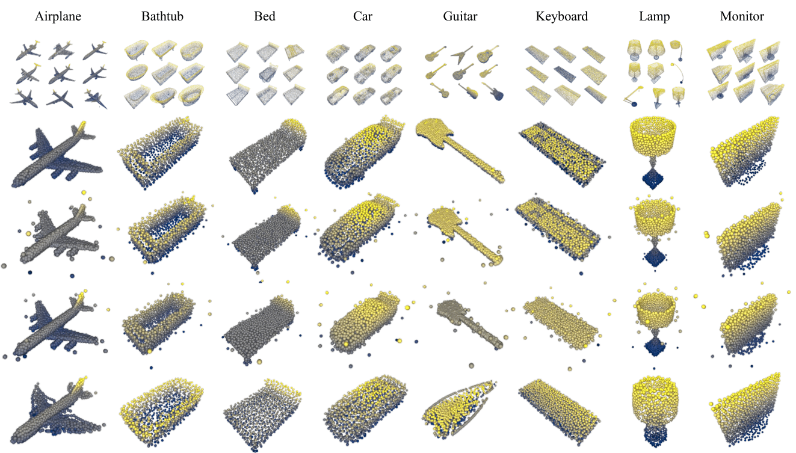

# [NeurIPS 2025] Dataset Distillation of 3D Point Clouds via Distribution Matching  

[](https://arxiv.org/abs/2503.22154)  [](https://neurips.cc)  [](./LICENSE)  


*Figure: Overall framework of the proposed dataset distillation method.*  

---

## Introduction  

Large-scale 3D point cloud datasets are essential for training deep neural networks but impose heavy computational burdens. We propose a **distribution matching-based dataset distillation framework** that jointly optimizes both geometric structures and orientations of synthetic 3D point clouds.  

**Key contributions:**  
- **Semantically Aligned Distribution Matching (SADM):** Introduces feature sorting within each channel to mitigate semantic misalignment caused by unordered point indices.  
- **Orientation-Aware Optimization:** Learns optimal rotations of synthetic 3D objects, reducing intra-class variability and improving feature alignment.  
- **Superior Generalization:** Achieves strong cross-architecture generalization across PointNet, PointNet++, DGCNN, and Point Transformer.  

Our method consistently outperforms existing dataset distillation and coreset selection approaches on benchmarks such as ModelNet10, ModelNet40, ShapeNet, and ScanObjectNN.  

---

We visualize the distilled synthetic datasets compared with baseline methods (DC, DM) on ModelNet40. Our method preserves the semantic structure of 3D objects (e.g., edges, corners, class-specific shapes), while existing methods tend to collapse to noisy or less informative patterns.

  
*Figure: Comparison of synthetic datasets distilled by DC(row1), DM(row2), and our(row3) method.*


## News  

- **2025-09-24**: Our paper has been **accepted to NeurIPS 2025** 🎉  
- **2025-05-29**: Preprint released on [arXiv](https://arxiv.org/abs/2503.22154).  


## Quickstart  

```bash
git clone https://github.com/donguk071/SADM.git
CUDA_VISIBLE_DEVICES=0 python main.py --ppc 1  --dataset MODELNET40 
```


## Citation  

If you find our work useful, please cite:  

```bibtex
@article{yim2025dataset,
    title={Dataset Distillation of 3D Point Clouds via Distribution Matching},
    author={Yim, Jae-Young and Kim, Dongwook and Sim, Jae-Young},
    journal={arXiv preprint arXiv:2503.22154},
    year={2025},
    url={https://arxiv.org/abs/2503.22154}
}
```
